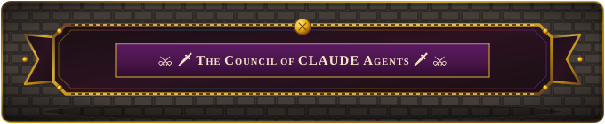

.. role:: raw-html(raw)
    :format: html

.. role:: redBold
.. role:: orangeYellowBold
.. role:: greenBold

AI Capability in Modding
========================

.. image:: https://img.shields.io/badge/Claude-d97757?style=for-the-badge&logo=claude&logoColor=white
    :alt: Claude
    :target: https://claude.ai/login

:raw-html:` `

First, Special Thanks ❤ to |TheCouncilMini| in accelerating and automating the most of the work in this project.

:raw-html:` `

:raw-html:` `

**Council Members**

Also, huge thanks to `all The Council Members`_ for contributing to the project.

:raw-html:` `

----

:raw-html:` `

Now in this new age of AI, you may be wondering, how good is AI in modding. We decided to experiment with
this using `CLAUDE`_. Mainly we used `CLAUDE Opus`_ with the occasional use of `CLAUDE Fable`_ for pioneering into 
unchartered territories (eg. discovering how to automate WuWa remaps or multi component remaps).

:raw-html:` `

Modding Capabilities
--------------------
We gave `CLAUDE`_ a `variety of different tools`_ to interact with mods. Some modding features it is able to do are:

.. tip::
    You can try these features on your own local computer with `CLAUDE`_ once you cloned the repo

.. warning::
    These features require both `AGRemap's tool set`_ and `the collective experience of The Council`_

:raw-html:` `

.. list-table::
   :widths: 50 50
   :header-rows: 1

   * - Feature
     - Description
   * - Mod Analysis
     - Can visualize and analyze mods in pure binary without using `Blender`_ or any `CAD tools`_
   * - Frame Dump Analysis
     - Can analyze and collect frame dumps
   * - Vertex Group Remap Creation
     - Able to find a vertex group remap within minutes compared to the human who would take days to find the remap
   * - Game Control
     - Able to navigate through basic menus, rotate the camera and move your character. Also can interact with 3dmigoto.
   * - DDS Texture Viewing and Editting
     - Able to open up and view .dds textures
   * - AGRemap usage for fixing mods
     - Can use AGRemap to build custom .ini fixing tools
   * - Mod rehash fixing
     - By analyzing frame dumps, could find which hashes are stale and got rehashed due to a game update.
   * - Mod unzipping
     - Are you tired of downloading a bunch of mods, then needing to unzip the compressed files and move the folders somewhere. The AI can now do that for you.

:raw-html:` `
:raw-html:` `

Speedup
-------

With these features, about 80-90% of the remap pipeline is automated. The only parts in a remap that still require manual intervention are:

- Merging download assets to the master branch
- Doing a final in-game check to verify whether the AI has done its job properly

:raw-html:` `

Overall, the AI would take about 5-8 hours to finish an entire remap, while a human would take about 3-5 days to finish a remap.

:raw-html:` `
:raw-html:` `

Quality
-------
One question you may have is how good is the AI in modding. Is it generating a lot of AI slop/mistakes? We breakdown the rating of its
different skills in the table below, rated out of 10.

.. warning::
    These features require both `AGRemap's tool set`_ and `the collective experience of The Council`_. Using a `CLAUDE`_ without the repo's
    help would probably result in far worse results.

:raw-html:` `

.. list-table::
    :widths: 40 15 45
    :header-rows: 1

    * - Skill
      - Grading
      - Notes
    * - | Model/Mesh Analysis and Diagnosis
      - | :greenBold:`8.8`
      - | Pretty impressed with AI in this area. Way better at analyzing meshes compared to you and me who need to slowly look using `Blender`_ or some adhoc python script. 
        | You point it at some mesh problem, it is able to clearly diagnose the issue. Only weakness is that it is flooded with a bit too much information so it sometimes
        | can miss certain details.
    * - | Texture Analysis and Diagnosis
      - | :orangeYellowBold:`6.5`
      - | Creates lots of theories of why some texture in some part of a character is rendering wrong. Most of those theories are debunked from an in game check.
        | The good thing is that we gave the AI control over the game to check how the texture is rendering so it can debunk most of their own theories faster. 
        | Though, I don't blame the AI, even if I give this problem to a modder, they would probably be struggling as much. Texture issues are a lot more ambiguous where many different paths could lead
        | to the same texture effect. The challenge is finding the root cause to your problem.
    * - | Frame Dump Analysis
      - | :greenBold:`9.0`
      - | Insane how the AI can actually make sense of all the sea of data in a dump. They use the dumps as the ground truth to help diagnose different mod problems or to build identity mods
        | for a sanity test on their remap. Before, this project's downloads would rely on asset repos like `GIMI Assets`_ or `WWMI Assets`_ to populate asset downloads. Now I can directly retrieve
        | the downloads from the source frame dumps.
    * - | Vertex Group Remap Finding
      - | :greenBold:`8.3`
      - | They already have a `script to mathematically find the closest vertex group`_ which saves a tremendous amount of work. The only part left is that they need to judge using some context
        | of whether to change the mapping of a vertex group to some other vertex group that is not necessarily the closest. With the audit gates in the pipeline, this second part is improved with
        | fewer instances of mesh issues in game. What is usually not covered are small details that are hard to perceive in game.
    * - | Game Control and Viewing
      - | :greenBold:`7.2`
      - | Is pretty wack that the AI can do basic actions to control your game. Though one limitation of our current setup is that the AI can only view the game through screenshots.
        | Doing video detection is another can of worms and would probably require an external plugin. With screenshots, the AI does miss some small details, which is why the remap
        | still requires a final manual in-game check by a human. Also, the AI's actions in the game are pretty conservative. They would typically rotate the camera 360 degrees all around
        | the character to capture every angle. However, they would rarely do actions like zooming in, move your character in the overworld, etc... So with the current setup, AI is nowhere
        | near playing the abyss for you.
    * - | AGRemap usage in prototypes and API fixes
      - | :greenBold:`7.0`
      - | Even with a rich mod fixing library in front of them, the AI rathers reinvent the wheel over problems that are already covered by the library. This has improved with some reminder in the `CLAUDE.md files`_
        | Good thing is that, once one framework has been established in the library for a particular type of fix, the other future agents just use the same framework.

.. _CLAUDE: https://en.wikipedia.org/wiki/Claude_(AI)
.. _CLAUDE Opus: https://www.anthropic.com/claude/opus
.. _CLAUDE Fable: https://www.anthropic.com/claude/fable
.. _variety of different tools: https://github.com/nhok0169/Anime-Game-Remap/tree/master/Tools
.. _Blender: https://www.blender.org/
.. _CAD tools: https://en.wikipedia.org/wiki/Computer-aided_design
.. _AGRemap's tool set: https://github.com/nhok0169/Anime-Game-Remap/tree/master/Tools
.. _the collective experience of The Council: https://github.com/nhok0169/Anime-Game-Remap/blob/master/AI%20Agent%20Help/README.md
.. _CLAUDE.md files: https://github.com/nhok0169/Anime-Game-Remap/blob/master/AI%20Agent%20Help/README.md
.. _GIMI Assets: https://github.com/SilentNightSound/GI-Model-Importer-Assets
.. _WWMI Assets: https://github.com/SpectrumQT/WWMI-Assets
.. _script to mathematically find the closest vertex group: https://github.com/nhok0169/Anime-Game-Remap/blob/master/Tools/VGRemapFinder/GI/GIVGRemapFinder.ipynb
.. _all The Council Members: https://github.com/nhok0169/Anime-Game-Remap/blob/master/AI%20Agent%20Help/README.md