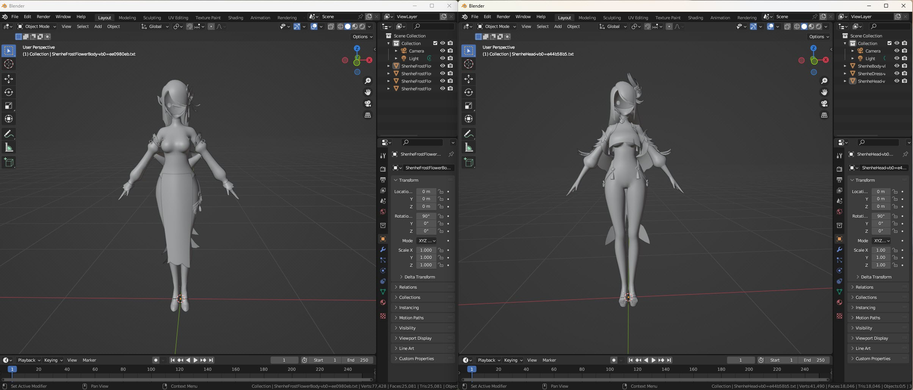
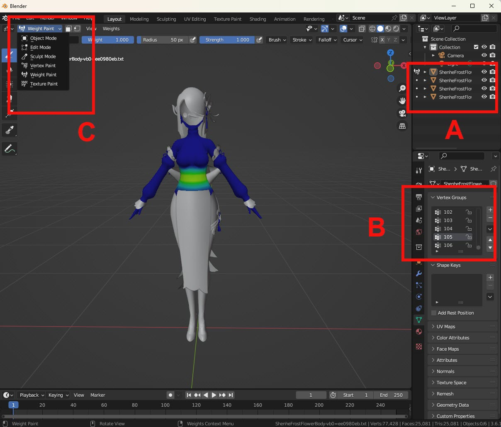
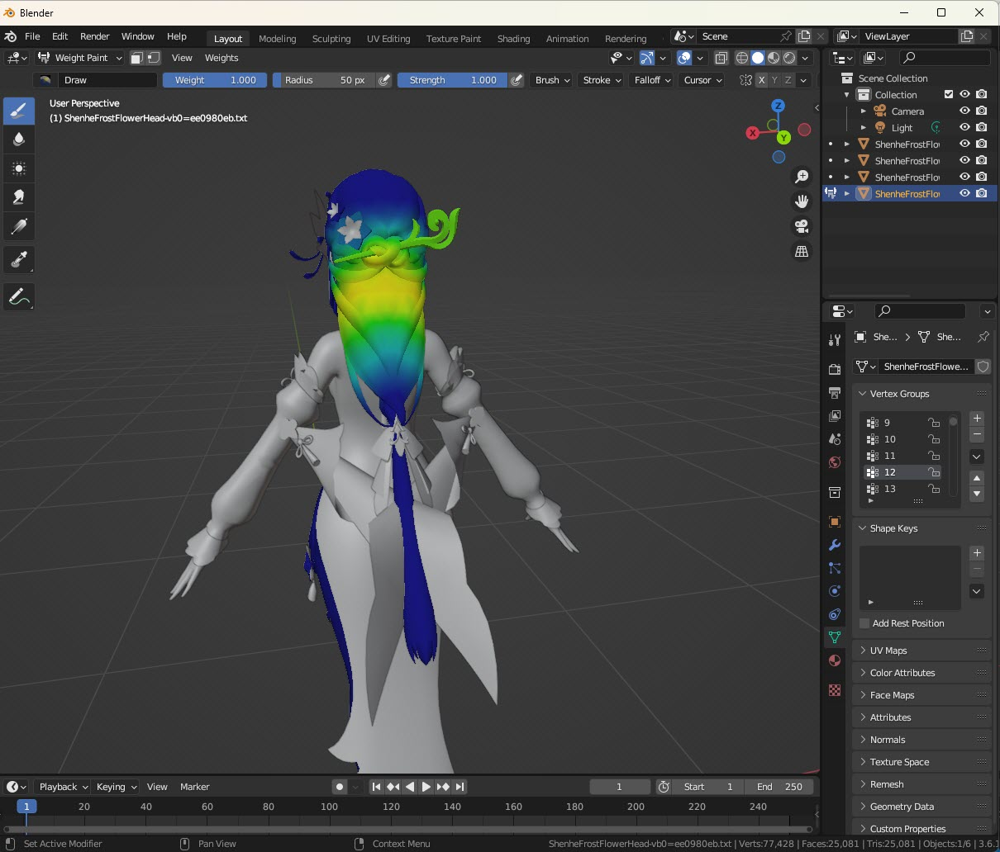
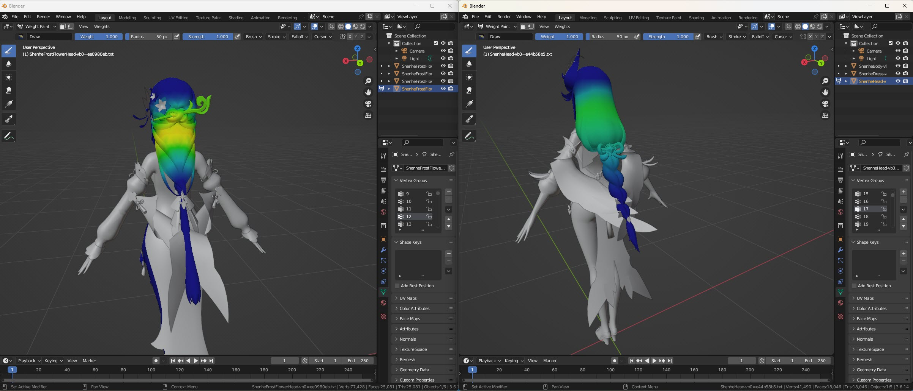
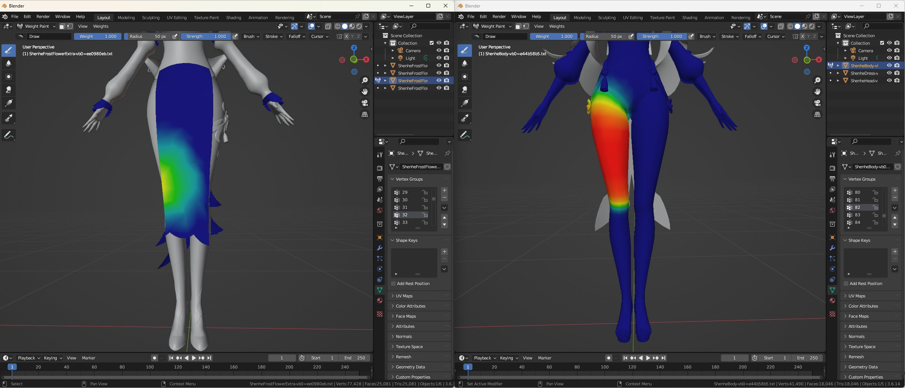

.. role:: raw-html(raw)
    :format: html

How to Find a Vertex Group Remap
================================

Requirements
------------
- Blender 3.6 with the `GIMI Blender Plugin`_ installed
- The dump file assets to the original character and the character to remap to (You can check out `GIMI Assets`_ to check out some examples of character dump files)

:raw-html:` `
:raw-html:` `

1. Import the dump files of the characters into Blender
--------------------------------------------------------
If you do not know how to this, you can check out the beginning (up to step 5.) of the `GIMI Mona Walkthrough`_

For our example, we will be remapping **ShenheFrostFlower** to **Shenhe**. 
First open up **ShenheFrostFlower** and **Shenhe** in seperate windows of Blender.

:raw-html:` `

For the rest of this tutorial, we will only be using the following features within Blender:

A. **Mod Objects:** The different objects that make up a mod. We will be switching between different objects to find the location of the desired vertex group.
B. **Vertex Groups:** The full list of all the vertex groups within a mod.
C. **Weight Paint Mode:** A viewing mode to visually check out the vertex groups. When this mode is enabled, you will see some sort of heat map for the part of the mod.
Hotter colours indicate where the selected vertex group is located.

:raw-html:` `
:raw-html:` `

2. Create some Excel/CSV file to record your mapping
----------------------------------------------------
We will be recording the vertex group remap in some sort of Excel/CSV file. Please refer to the `Remap Draft Format`_ for the format of the file.

:raw-html:` `
:raw-html:` `

3. Find the Location of a Vertex Group in the Original Character
----------------------------------------------------------------
For simplicity, we will first be focusing on vertex group 12 of ShenheFrostFlower. To find where vertex group 12 is located, you would:

a. Select a mod object
b. Switch to weight paint mode
c. Select your target vertex group you are searching for (12 for our case)
d. Find if there is some area on ShenheFrostFlower that have hotter colours
e. Repeat steps 3a. to 3d. with a different mod object until you found some region with hotter colours for some mod object that matches the vertex group you are searching for

:raw-html:` `

.. note::
    When switching between mod objects, you may need to first switch from *weight paint mode* back to *object mode*, before you
    could select the new mod object.

.. note::
    After switching to a new mod object, you would also have to reselect the vertex group selection back to the vertex group you are searching for

:raw-html:` `

If you have done this properly, you would have found that vertex group 12 belongs to ShenheFrostFlower's head object, specifically at the
back of her head.

:raw-html:` `
:raw-html:` `

4. Find the Corresponding Matching Vertex Group in the Character to Remap to
----------------------------------------------------------------------------
We would need to find the "nearest" vertex group remap in Shenhe that matches vertex group 12 of ShenheFrostFlower.

Using what we learned from Step 3, by brute force, we will go through all of the vertex groups in Shenhe to see which vertex group
seems to be the "nearest" to vertex group 12 of ShenheFrostFlower.

Fortunately, you would have found that vertex group 17 of Shenhe seems to be the best match for vertex group 12 of ShenheFrostFlower.

:raw-html:` `

Sadly not all vertex groups are that easy to match.
Some vertex groups are not necessarily mathmatically the nearest, requiring you to use a bit of "creativity" and "human intuition"

An example of such vertex groups would be to find the matching vertex group for vertex group 32 of ShenheFrostFlower.

Checking out vertex group 32 of ShenheFrostFlower, you would notice that this vertex group corresponds to the front of ShenheFrostFlower's dress.
But Shenhe does not have any front part for her dress!

We observe that vertex group 32 of ShenheFrostFlower is near the right part of the dress and is located very slightly above her knee.
In Shenhe, the "nearest" part that matches the location would be her right thigh. Checking out the vertex groups of Shenhe, you would have found
that vertex group 82 of Shenhe corresponds to Shenhe's right thigh.

So vertex group 32 of ShenheFrostFlower matches vertex group 82 of Shenhe

:raw-html:` `

.. tip::
    There may be cases that many vertex groups of the character to remap from map to the same vertex group of the character to remap to.

    An example would be vertex group 31 and vertex group 32 for **ShenheFrostFlower**. Both of these vertex groups correspond to vertex group 82 of Shenhe

    (vertex group 31 and vertex group 32 of ShenheFrostFlower correspond to the front-right part of ShenheFrostFlower's dress, so they "closely" match
    to the right thigh of Shenhe)

:raw-html:` `
:raw-html:` `

5. Record the Found Vertex Group Remap into the Excel/CSV
---------------------------------------------------------
Add the vertex group remap found in Step 4. into the Excel. 

You can optionally add any comments to note about this remap for easier debugging.
Or you can optionally add an uncertainty value for to the remap if you are not confident about the remap that you have done.

:raw-html:` `
:raw-html:` `

6. Find the Matching Vertex Groups for the Rest of the Vertex Groups in the Character to Remap From
---------------------------------------------------------------------------------------------------
ShenheFrostFlower has 106 vertex groups in total. Repeat Step 3-4 for the other vertex groups in ShenheFrostFlower.

:raw-html:` `

.. tip::
    At first this procedure may seem very tedious.

    But luckly, a common pattern is that consecutive vertex groups mostly are near each other.

    If you arrive at such a pattern, a very easy prediction would be to predict that the next vertex group of the character to
    remap from would match the next vertex group of the character to remap to.

    This is formally defined below:

    .. code-block::

        let A = the character to remap from and let A[i] be vertex group i for character A
        let B = the character to remap to and let B[i] be vertex group i for character B

        if A[i] matches with B[i], then predict that:
        A[i + 1] matches B[i + 1]

    An example of such a situation would usually be when you arrive at a character's fingers.
    For most cases, once you found the remap for 1 finger, you would probably be able to predict the next 14 vertex group remaps
    since the next 14 vertex groups correspond to other parts within the character's hand.

    (Those who are familiar with *computer architecture* may find this similar to an `Always Taken Branch Predictor`_ or a `One Bit Saturating Counter Branch Predictor`_ in the field of `Branch Prediction`_)

7. Find the Vertex Group Remap for the Character to Remap to (the Opposite Direction)
-------------------------------------------------------------------------------------
Now that you have found the vertex group remap for ``ShenheFrostFlower --> Shenhe``, 
you would now need to find the vertex group remap for ``Shenhe --> ShenheFrostFlowers`` by repeating Step 3-6

:raw-html:` `

.. warning::
    A common misconception would be to simply invert the mapping for the previous character you just found.

    However, you cannot just do this since for most cases, remaps are not exactly one-to-one. :raw-html:` `
    (Since many vertex groups of one character may remap to the same vertex group of another character, remaps are considered an `onto transformation (surjective function)`_)

.. tip::
    From the warning above, we know that remaps are not one-to-one, but luckly, a subset of the vertex group remaps are one-to-one.

    One quick way to find the vertex group remap of the other character would be to:

    #. Invert the vertex group remap found for the previous character (using a `VLOOKUP`_ in Excel)
    #. Verify each vertex group in the inverted remap

.. _GIMI Blender Plugin: https://github.com/SilentNightSound/GI-Model-Importer/?tab=readme-ov-file#installation-instructions-3dmigoto-blender-plugin
.. _GIMI Assets: https://github.com/SilentNightSound/GI-Model-Importer-Assets
.. _GIMI Mona Walkthrough: https://github.com/SilentNightSound/GI-Model-Importer/blob/main/Guides/MonaWalkthrough.md
.. _Remap Draft Format: https://github.com/nhok0169/Anime-Game-Remap/blob/nhok0169/Data/RemapDrafts/README.md
.. _Always Taken Branch Predictor: https://en.wikipedia.org/wiki/Branch_predictor#Next_line_prediction
.. _One Bit Saturating Counter Branch Predictor: https://en.wikipedia.org/wiki/Branch_predictor#One-level_branch_prediction
.. _Branch Prediction: https://en.wikipedia.org/wiki/Branch_predictor
.. _onto transformation (surjective function): https://en.wikipedia.org/wiki/Surjective_function
.. _VLOOKUP: https://support.microsoft.com/en-us/office/vlookup-function-0bbc8083-26fe-4963-8ab8-93a18ad188a1