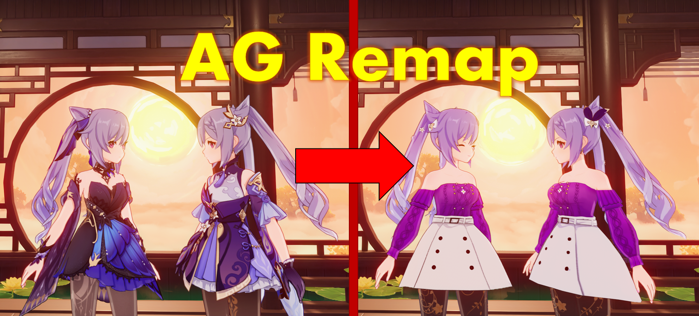

.. role:: raw-html(raw)
    :format: html

Welcome to Anime Game Remap's documentation!
============================================

.. image:: https://img.shields.io/pypi/pyversions/FixRaidenBoss2?style=for-the-badge
    :alt: Python Version
    :target: https://www.python.org/downloads/

.. image:: https://img.shields.io/pypi/v/FixRaidenBoss2?label=FixRaidenBoss2%20pypi&style=for-the-badge 
    :alt: FixRaidenBoss2 Pypi Version
    :target: https://pypi.org/project/FixRaidenBoss2/

.. image:: https://img.shields.io/pypi/v/AnimeGameRemap?label=AG%20Remap%20pypi&style=for-the-badge    
    :alt: AG Remap Pypi Version
    :target: https://pypi.org/project/AnimeGameRemap/

.. image:: https://img.shields.io/pepy/dt/FixRaidenBoss2?style=for-the-badge&label=FixRaidenBoss2%20Downloads
    :alt: FixRaidenBoss2 Pypi Total Downloads
    :target: https://pypi.org/project/FixRaidenBoss2/

.. image:: https://img.shields.io/pepy/dt/AnimeGameRemap?style=for-the-badge&label=AG%20Remap%20Downloads
    :alt: AG Remap Pypi Total Downloads
    :target: https://pypi.org/project/AnimeGameRemap/

.. image:: https://img.shields.io/github/downloads/nhok0169/Anime-Game-Remap/total?label=Github%20Downloads&style=for-the-badge  
    :alt: Github Downloads
    :target: https://github.com/nhok0169/Anime-Game-Remap/releases/latest

.. image:: https://img.shields.io/pypi/dm/FixRaidenBoss2?style=for-the-badge&label=FixRaidenBoss2%20Pypi%20Monthly 
    :alt: FixRaidenBoss2 Pypi Monthly Downloads
    :target: https://pypi.org/project/FixRaidenBoss2/

.. image:: https://img.shields.io/pypi/dm/AnimeGameRemap?style=for-the-badge&label=AG%20Remap%20Pypi%20Monthly
    :alt: AG Remap Pypi Monthly Downloads
    :target: https://pypi.org/project/AnimeGameRemap/

.. image:: https://readthedocs.org/projects/anime-game-remap/badge/?version=latest&style=for-the-badge
    :target: https://anime-game-remap.readthedocs.io/en/latest/?badge=latest
    :alt: Documentation Status

.. image:: https://img.shields.io/github/actions/workflow/status/nhok0169/Anime-Game-Remap/unit-tests.yml?label=Unit%20Tests&style=for-the-badge
    :target: https://github.com/nhok0169/Anime-Game-Remap/actions/workflows/unit-tests.yml
    :alt: Unit Tester Status

.. image:: https://img.shields.io/github/actions/workflow/status/nhok0169/Anime-Game-Remap/integration-tests.yml?label=Integration%20Tests&style=for-the-badge
    :target: https://github.com/nhok0169/Anime-Game-Remap/actions/workflows/integration-tests.yml
    :alt: Integration Tester Status

Anime Game Remap is the **Official** library to help remap the mods installed on a character onto the skins of the character.

:raw-html:` `

Requirements
-------------

- Install `Python <https://www.python.org/downloads/>`_ version 3.6 or higher

:raw-html:` `

.. note::
    Usually, if the .ini files of your mod are generated by the standard scripts provided by GIMI, then you can skip
    the following link. The link below is dedicated to mods with custom made .ini files to ensure the library
    run smoothly on those mods.

    **File Requirements**: :doc:`fileRequirements`

.. important::
    Remapping mods is overall a hacky process. Please see :doc:`remapGrading` for the current limitations of remapping your particular mod.

.. toctree::
  :caption: Requirements
  :hidden:

  fileRequirements

:raw-html:` `

Getting Started
---------------

- **Tutorial**: :doc:`tutorial`
- **Examples**: Lot of examples are available `here <https://github.com/nhok0169/Anime-Game-Remap/tree/nhok0169/Examples>`_
- **Command Options**: :doc:`commandOpts`
- **Remap Grading**: :doc:`remapGrading`

.. toctree::
  :caption: Script Fix
  :hidden:

  tutorial
  commandOpts
  remapGrading

:raw-html:` `

API
---

- **Setup**: :doc:`apiSetup`
- **Simple Examples**: :doc:`apiExamples`
- **API Reference**: :doc:`api`

.. toctree::
  :caption: API
  :hidden:

  apiSetup
  apiExamples
  api
